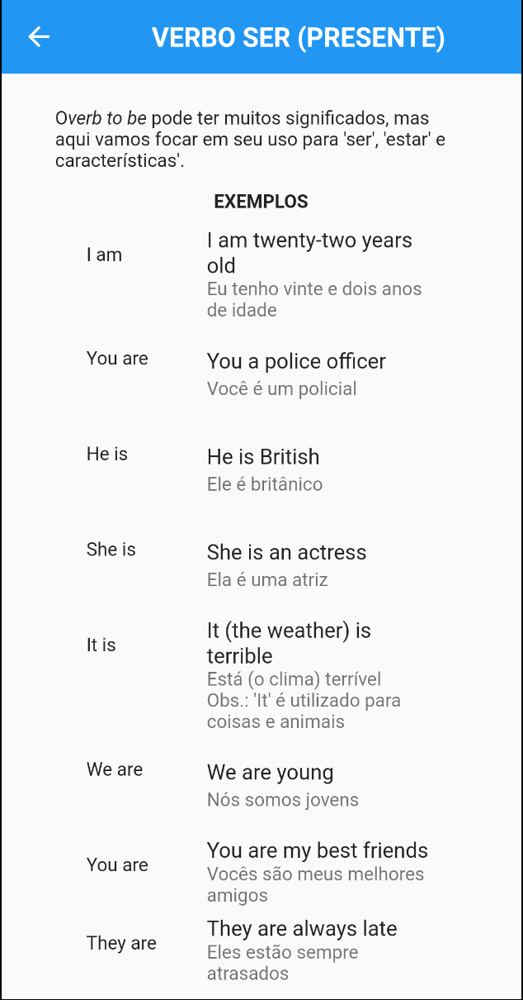
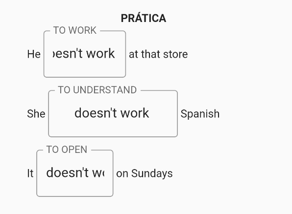
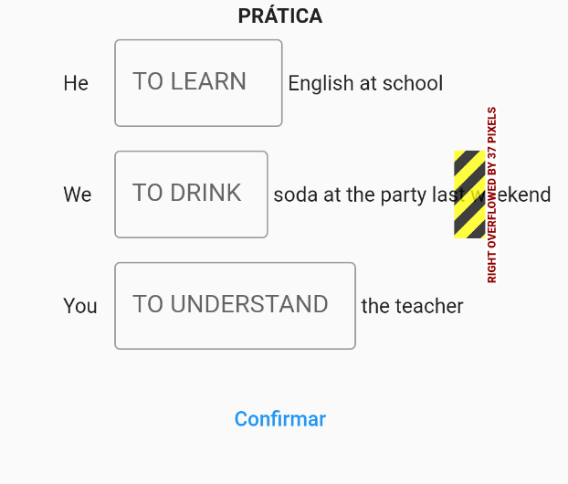

# LET`S LEARN APP

Aplicativo de educação

## Avaliação

### Geral

O layout do aplicativo seguiu o clássico Material Design do Scaffold do Flutter. No entanto, a arquitetura utilizada não segue fielmente aquela ensinada em sala de aula. Dessa forma, o datasource é instanciado diretamente na página, ou seja, não há separação das responsabilidades.

Apesar da simplicidade do aplicativo, a ideia tem potencial e vale a pena ser explorada e incrementada. Por exemplo, é possível separar as atividades de acordo com o nível da pessoa ou para um público específico que necessite de atenção e suporte adequados, os quais não são fornecidos pelos aplicativos atuais.

### Comentário

Abaixo estão listados os "problemas", pontos de melhoria ou bug, encontrados nas páginas. As páginas que não foram listadas é porque não foram acessíveis na executação do app e, por isso, a sua avaliação não foi possível.

As imagens utilizadas no projeto não estava configuradas corretamente:

#### Tela Login

Ao clicar em `Login` abre uma página de Login sobre a página de Login atual. Em caso de usuário inválido, deveria mostrar uma mensagem de erro.

Os textos `Esqueci a Senha` e `Novo por aqui? Crie uma conta clicando aqui` não tem nenhuma ação.

#### Tela Lista

Há um botão de voltar para a tela de login, normalmente a gente adiciona um botão para fazer o `Logout`, que após clicado remove o token da sessão.

#### Tela Atividade Page

Cada atividade virou uma página, que faz sentido para app com poucas atividades. Mas era esperado, que tivesse a lista de atividades salva no banco de dados, poderia usar o shared_preferences, onde seria carregado ao abrir a página tanto da listagem quanto para resolver a atividade.

Atividades com muito textos, por exemplo, as atividades 1, 2, 3, não aparece os campos para colocar a resposta ou aparece cortando a informação.

Na atividade 7, ao alterar a informação no primeiro campo, a informação foi replicada em todos os outros campos. Isso ocorre porque foi usado o mesmo controller para o três campos `controller: _campoResposta[0].`

Ao clicar em `Confirmar`, é direcionado para a tela de Lista, mas ao clicar novamente na atividade, a última resposta não vem preenchida.

Ao selecionar a atividade 5 ou 10, há quebra de layout

